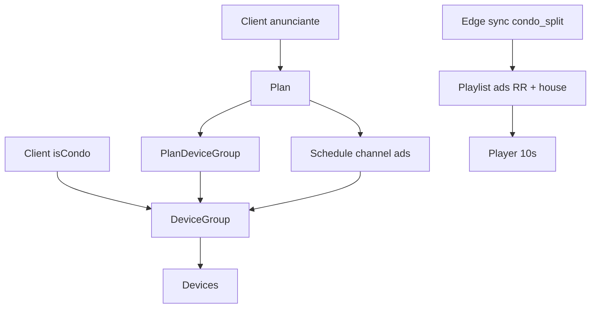

# Grupos de telas, capacidade e rodízio de anúncios

Documentação do inventário comercial LEDE Ads: grupos por condomínio, planos (`10s × amostragens/dia × meses`), capacidade diária e playlist do Edge.

## Conceitos

| Conceito | Descrição |
|----------|-----------|
| **DeviceGroup** | Grupo de telas de **um condomínio** (`Client.isCondo`). Anunciantes compram espaço nesse grupo. |
| **Capacidade/dia** | `(viewingHoursPerDay × 3600 / sampleDurationSec) × N_telas`. Defaults: **18h** e **10s** → **6480 × N** amostragens/dia. |
| **Plano** | Contrato do anunciante: `samplesPerDay`, `sampleDurationSec` (10), `months`, vigência `startsAt`/`endsAt`, ligado a um ou mais grupos via `PlanDeviceGroup`. |
| **Schedule ads** | Agenda com `channel=ads` e `groupId` (expande para todas as telas do grupo no sync). |
| **House ad** | Cena `isHouseAd` (“Anuncie AQUI”) — preenche **slots vagos** (inventário não vendido) e o restante do dia após cotas esgotadas. Sem plano/cota. |



## Capacidade

```
slotsPerScreenDay = viewingHoursPerDay * 3600 / sampleDurationSec   // 6480
capacityPerDay    = slotsPerScreenDay * deviceCount
soldPerDay        = sum(samplesPerDay) dos planos active na vigência no grupo
vacantPerDay      = max(0, capacityPerDay - soldPerDay)
```

- Criar/editar plano **rejeita overbook** se `sold + novo > capacity` em qualquer grupo alvo.
- Produto na UI: **`10s × samplesPerDay × months`** (estimativa de amostragens ≈ `samplesPerDay × 30 × months`).

### Dashboard

- Web: `/dashboard/capacity`
- API: `GET /api/capacity`, `GET /api/capacity/groups/:id`

Mostra ocupação, vagas, badge **Lotado**, e **próxima vaga** (`endsAt` mais próximo + amostras liberadas).

## Rodízio no elevador (`condo_split`)

No `GET /edge/sync`:

1. Resolve `device.groupId`.
2. **Condo:** um schedule `channel=condo` do `device.clientId` (zonas condo fixas).
3. **Ads pagos:** todos os schedules `ads` do grupo (ou `deviceId`) com plano vigente e PoP do dia &lt; `samplesPerDay`.
4. Monta playlist: cada item = zonas condo + zonas ads daquele anunciante.
5. **Fill house:** `vacantRatio = vacant / capacity`. Anúncios pagos ficam **iguais entre si**; house ocupa ~`vacantRatio` do artime.
   - Sem planos vendidos → só house (+ condo).
   - Todos bateram cota no dia → só house (+ condo).

O player Android faz round-robin em `scenes[]` com `scene.durationMs` (~10s).

Modo **`standard`:** continua lista de agendas `full` (sem merge condo/ads).

## Fluxo operacional (LEDE)

1. Cadastre o **condomínio** (`isCondo`) e as **telas** (`condo_split`).
2. Crie um **grupo de telas** (`/dashboard/device-groups`) e vincule as telas + cena house (opcional; senão usa a primeira `isHouseAd` global).
3. Crie **plano** do anunciante com amostragens/dia, meses e grupos alvo.
4. Crie **cena ads** (só zona `ads`) e **agendamento** `channel=ads` apontando ao **grupo**.
5. Acompanhe inventário em **Capacidade**.

## API

| Área | Endpoints |
|------|-----------|
| Grupos | `GET/POST /device-groups`, `GET/PATCH/DELETE /device-groups/:id` |
| Capacidade | `GET /capacity`, `GET /capacity/groups/:id` |
| Planos | `POST/PATCH /plans` aceita `months`, `groupIds[]` |
| Agendas | `groupId` opcional; obrigatório na UI para canal `ads` |
| Devices | `groupId` no create/update |

## Seed

Após `npm run prisma:seed`:

- Cliente **LEDE** + cena/mídia **Anuncie AQUI** (`isHouseAd`)
- Grupo **Elevadores Condo Demo** no condomínio demo
- Plano demo ~2000 amostragens/dia × 3 meses no grupo
- Elevador Demo com `groupId` e agendas condo/ads

## Migração

```bash
cd apps/cloud-api
npx prisma migrate deploy   # produção / CI
# ou
npx prisma migrate dev      # local
```

Migration: `20260803210000_device_groups_capacity`.
